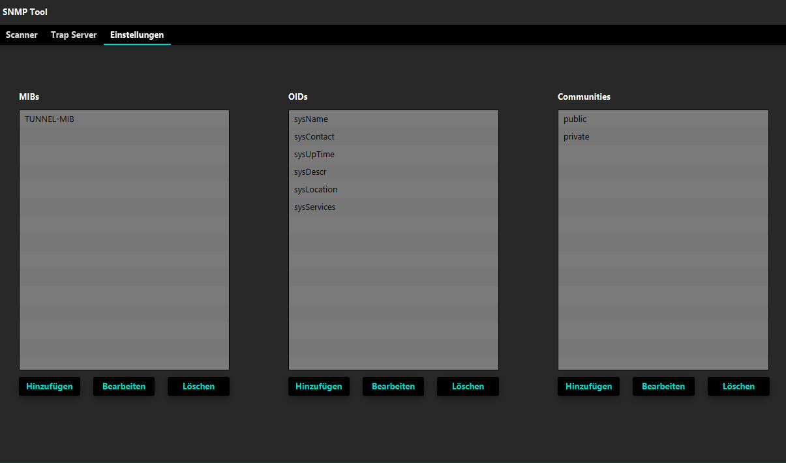

# Abhängigkeiten
Das Programm verwendet die Bibliothek [tnm4j](https://github.com/soulwing/tnm4j).
Java Version 1.8 verwendet und SDK default.

# Jar ausführen
Laden sie die Jar Datei unter den letzten Release herunter. Führen sie es mit der Eingabeaufforderung (CMD) mit dem Befehl `java -jar [JAR-NAME]` aus.
# Projekt selbst in IDE ausführen
Um den Scanner selbst auszuführen, importieren Sie das Projekt in Ihre bevorzugte IDE. Für dieses Beispiel werde ich IntelliJ IDEA (Ultimate Version) verwenden. Die Community Version kann kostenlos von [hier](https://www.jetbrains.com/idea/download/#section=windows) heruntergeladen werden.

1. Öffnen Sie IntelliJ IDEA.
2. Navigieren Sie zu `File > New > Project from Version Control > Git`
3. Geben Sie hier den folgenden Link ein: https://github.com/Tobi-Ferretti/SNMP_Tool.git und bestätigen Sie mit `Clone`.
4. Klicken Sie nun mit der rechten Maustaste auf den Projektnamen und navigieren Sie zu `Add Frameworks Support` und aktivieren Sie die **Checkbox mit Maven**. Bestätigen Sie mit **OK**.
5. Unter `Project Structure > Project Settings > Project > Project SDK` wählen Sie **1.8** aus und setzen die `project language level` auf **"SDK default"**.
6. Im letzten Schritt gehen Sie auf `Add Configuration > + > Application` und wählen Sie als Hauptklasse **"it.fallmerayer.com.main.Main"**.
7. Optional können Sie auch den Namen auf Main setzen. Bestätigen Sie mit OK.
8. Das war's schon. Jetzt nur noch auf den **grünen Play-Button** drücken und die Anwendung sollte starten.

# Projekt Status
Projekt ist fertiggestellt, kann jedoch noch einige Bugs enthalten.
#### Übersicht der Funktionen

* Scannen des Host
* Scannen eines Netzwerks
* Scan einer benutzerdefinierten Range
* Methode wechseln (Get und GetNext)
* GUI
* Anfragen können an verschiedene Communities gleichzeitig geschickt werden
* Traps/Informs können abgehört werden
* Der abzuhörende Port ist änderbar
* Es können eigene MIBs, OIDs und Communities hinzugefügt werden

# Funktionen
   ### Adresse mittels SNMP abfragen
Die GUI kann **einen Host, ein ganzes Netzwerk oder eine benutzerdefinierte Range des Netzwerks** scannen.
Die Ergebnisse werden dann in der GUI dargestellt, bei keinem Ergebnis oder Fehler wird eine Fehlermeldung ausgegeben.

##### Starte Scan
Um ein Netzwerk zu scannen, muss man im Feld die **IP des Host** eintragen und dann 
die **Methode** auswählen. Beim Klick auf **Scan** wird eine **Anfrage geschickt**. Man kann
auch eine Anfrage an das **ganze Netz senden oder eine Range** angeben.

### Trap-Listner
Um den Listner zu aktivieren, muss man den **Haken setzten**, dabei hört der Listner auf Port `187`, dieser Port kann auch beliebig geändert werden.

#### MIBs, OIDS und Communities
`MIBs`, `OIDS` und `Communities` können in den Einstellungen beliebig **hinzugefügt, bearbeitet und gelöscht** werden

# GUI
Die grafische Oberfläche wurde mit der Bibliothek [JFoenix](https://github.com/jfoenixadmin/JFoenix) entwickelt. Diese Bibliothek benutzt die Elemente vom Google **Material Design**. 

